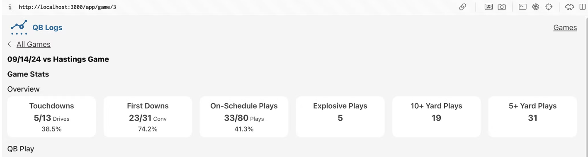
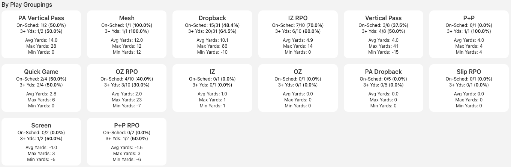
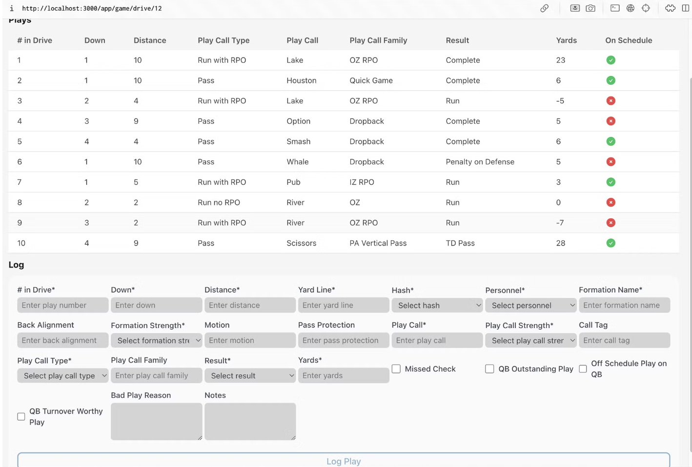

# QB Logs
A visual tool for a full picture of offensive production and QB play across games and practices.
1. Detailed QB performance analysis by play type
2. Integrated game and practice data for comprehensive assessment
3. Visual offensive production tracking for goal-setting
4. Custom analytics tailored for your level of play

The main idea is that showing offensive stats from games and practices in an easy-to-understand way, along with domain knowledge, will help small college and high school football teams. They'll use this data every day alongside film study. "Practice analytically, perform intuitively."

Currently only used by Briar Cliff football and I am working on developing out the required features to sell as a SAAS.

## App Features
- Authentication and Authorization using RLS by use case
- Reactive UI
- Type safety
- Admin functions to scaffold team setup and user accounts

### Stack
- Next.js (Tailwind)
- Supabase

### Dev Images

